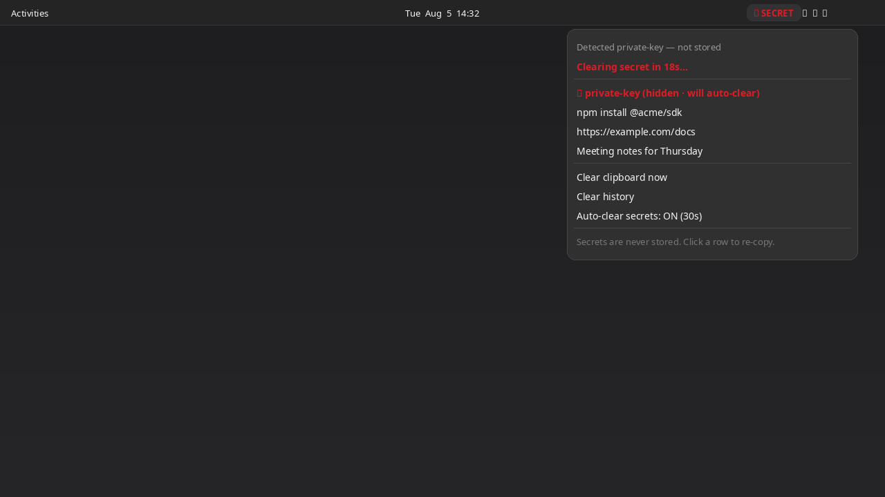

# Secure Clipboard

GNOME Shell extension: **secrets-aware clipboard** for the top panel — detect high-risk content, never store it, auto-clear after a timeout.



## Features

- Watches the clipboard (short poll interval)
- Classifies secrets (private keys, seed-like phrases, API tokens, JWTs, long hex keys, credential assignments, and similar)
- **Secrets are never stored** in history (redacted placeholder only)
- Auto-clear clipboard + primary selection after 30 seconds (default, toggleable)
- Short **in-memory** history for non-secret clips (session only; cleared on disable)
- Click a history row to re-copy

## Requirements

- GNOME Shell **45–50**

## Install

```bash
UUID=secure-clipboard@n0l0g1c.github.io
mkdir -p ~/.local/share/gnome-shell/extensions
cp -a "$UUID" ~/.local/share/gnome-shell/extensions/
gnome-extensions enable "$UUID"
```

Log out/in on Wayland (or restart GNOME Shell) so the extension is discovered.

## Clipboard access

This extension **reads the system clipboard** while enabled in order to classify content. That access is declared in `metadata.json`.

- Clipboard data is **never** sent to any network service
- Secrets are **not** written to disk or to history text
- History lives in memory only and is wiped in `disable()`

Optional config: `~/.config/secure-clipboard/settings.json`

```json
{
  "autoClearSecrets": true,
  "clearSeconds": 30,
  "maxHistory": 20
}
```

## Limits

- Heuristics can false-positive (for example long hex strings or word lists). Prefer auto-clear for safety.
- This is not a full password manager and does not encrypt history.

## Screenshots

| File | Contents |
|---|---|
| [`screenshots/screenshot.png`](screenshots/screenshot.png) | Primary store image — secret detected, countdown |
| [`screenshots/screenshot-history.png`](screenshots/screenshot-history.png) | Non-secret history |
| [`screenshots/icon.png`](screenshots/icon.png) | Optional icon asset |

## Packaging

```bash
./pack.sh
# → secure-clipboard@n0l0g1c.github.io.shell-extension.zip
```

Zip contents: `metadata.json`, `extension.js`, `stylesheet.css`, `LICENSE`.

This project follows the [GNOME Shell extension review guidelines](https://gjs.guide/extensions/review-guidelines/review-guidelines.html) (clipboard access disclosed, no third-party clipboard sharing, no default clipboard shortcuts, lifecycle cleanup, GPL-2.0-or-later).

## Development

```bash
cp -a secure-clipboard@n0l0g1c.github.io \
  ~/.local/share/gnome-shell/extensions/
journalctl -f /usr/bin/gnome-shell
```

## License

[GPL-2.0-or-later](LICENSE)

## Author

[N0L0g1c](https://github.com/N0L0g1c)
